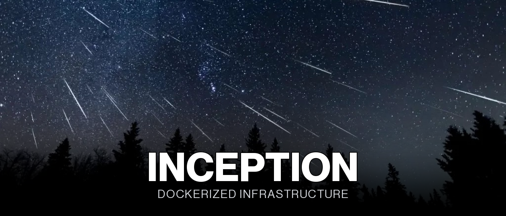

<div align="center">
  

  <p>
    <b>A small production-style web stack, containerized from scratch: NGINX, WordPress, and MariaDB at the core, with five bonus services layered on top.</b>
  </p>

  <p>
    <a href="https://42lausanne.ch"></a>
    
    
    
  </p>

  <p>
    
    
    
    
    
    
    
  </p>
</div>


<a name="overview"></a>
<h2 align="center">Overview</h2>

<div align="center">

`Inception` builds a small hosting stack the way it would actually be deployed: every core
service in its own container, built from a bare `debian` base image (no pre-built DockerHub
service images), talking to each other over a private Docker network. NGINX terminates TLS
and is the only container exposing an HTTP(S) port for the main site; WordPress runs behind
it as PHP-FPM, with no web server of its own; MariaDB persists everything to a bind-mounted
volume so data survives a container restart.

On top of the mandatory three-service stack, this implementation adds five bonus services:
a Redis object cache for WordPress, an Adminer database UI, an FTP server, a static website,
and an n8n automation instance that emails a form submitter automatically.

**[Read the full subject](Inception.pdf)**

</div>


<a name="highlights"></a>
<h2 align="center">Highlights</h2>

Mandatory NGINX/WordPress/MariaDB stack, plus five bonus services.

- **Every core image is built from scratch off a bare Debian base.** No `nginx`, `wordpress`, or `mysql` DockerHub image is used directly; each `Dockerfile` installs and configures the service itself.
- **NGINX terminates TLS for two virtual hosts on the same port.** `dinguyen.42.fr` serves WordPress and `n8n.dinguyen.42.fr` reverse-proxies to the n8n container, both via SNI-based `server_name` blocks on `443`, with a self-signed certificate.
- **WordPress gets a Redis object cache, not just a database.** The `redis-cache` plugin is installed and activated automatically on first boot, and configured to point at the `redis` container, cutting down repeated database hits for cached pages.
- **Adminer gives a database UI without exposing MariaDB itself.** It's the only bonus service that talks to `mariadb` directly; the database container itself never publishes a port to the host.
- **A n8n workflow automates the "contact the corrector" step.** A public form triggers a workflow that sends a confirmation email via Gmail SMTP, entirely from a container running inside the stack, no external service involved.
- **The FTP server shares the same WordPress volume.** A dedicated user can upload files directly into `/var/www/html/wordpress` over FTP, without needing shell access to the container.
- **Data paths are configurable, not hardcoded.** `DATA_PATH` is read from `.env` at `make` time, so the same Makefile works across machines instead of assuming a fixed host path.


<a name="build--usage"></a>
<h2 align="center">Build & Usage</h2>

```bash
cp srcs/.env.example srcs/.env   # then fill in real values
make        # creates data directories, builds every image, starts all containers
make down   # stops containers, data preserved
make re     # rebuild and restart, data preserved
make clean  # stop + remove volumes, data lost
make fclean # full cleanup: images, volumes, cache
```

Add both hostnames to `/etc/hosts` first:

```text
127.0.0.1  dinguyen.42.fr
127.0.0.1  n8n.dinguyen.42.fr
```

| Service | URL |
| --- | --- |
| WordPress | `https://dinguyen.42.fr` |
| n8n | `https://n8n.dinguyen.42.fr` |
| Adminer | `http://dinguyen.42.fr:8081` |
| Static website | `http://dinguyen.42.fr:8080` |
| FTP | `ftp://dinguyen.42.fr` (port 21) |


<a name="design-notes"></a>
<h2 align="center">Design Notes</h2>

The constraints here are less about any single line of code and more about container
boundaries: what each service is allowed to know about, and what it's isolated from.

> [!NOTE]
> **One process, one container, one responsibility.** Every service runs as a single foreground process (`nginx -g "daemon off"`, `php-fpm7.4 -F`, `n8n start`, ...); none of them daemonize internally, which is what lets Docker actually track whether the container is alive.

> [!IMPORTANT]
> **Only NGINX, the website, Adminer, and FTP publish ports.** WordPress, MariaDB, Redis, and n8n are reachable only from inside the `inception` bridge network, by container name; nothing outside the Docker host can talk to PHP-FPM, the database, the cache, or the automation engine directly.

> [!TIP]
> **Two TLS virtual hosts share one NGINX container and one certificate.** `dinguyen.42.fr` and `n8n.dinguyen.42.fr` are two separate `server` blocks in the same `nginx.conf`, distinguished by SNI, rather than two separate NGINX containers.

> [!WARNING]
> **The bonus part is only graded if the mandatory part is perfect.** All five bonus services depend on the mandatory NGINX/WordPress/MariaDB stack working correctly first; a broken mandatory part means the bonus services are never even evaluated.


<a name="infrastructure-layout"></a>
<h2 align="center">Infrastructure Layout</h2>

```text
INCEPTION/
├── Makefile                          # all / down / clean / fclean / re
├── DEV_DOC.md                        # Setup, env variables, data storage
├── USER_DOC.md                       # Service URLs, credentials, health checks
├── Inception.pdf                     # Subject
└── srcs/
    ├── docker-compose.yml            # All 8 services, volumes, and network
    ├── .env.example                  # Template for runtime configuration
    └── requirements/
        ├── nginx/                    # TLS termination for both virtual hosts
        ├── wordpress/                # PHP-FPM + wp-cli + Redis cache plugin
        ├── mariadb/                  # Idempotent first-boot database setup
        └── bonus/
            ├── website/              # Static NGINX site on :8080
            ├── adminer/              # Database UI on :8081
            ├── redis/                # WordPress object cache
            ├── ftp/                  # vsftpd, shares the WordPress volume
            └── n8n/                  # Automation engine + email-on-form-submit workflow
```


<a name="configuration-reference"></a>
<h2 align="center">Configuration Reference</h2>

<div align="center">

| Category | Parameters | Example |
| --- | :---: | --- |
| NGINX | 3 | `TLSv1.2 / TLSv1.3` |
| WordPress | 3 | `wp-cli` |
| MariaDB | 3 | `idempotent init` |
| Volumes & network | 3 | `bridge` |
| Bonus services | 5 | `n8n` |

</div>

<table width="100%">
<tr><th width="26%">Parameter</th><th>Value</th></tr>
<tr><td colspan="2" align="right"></td></tr>
<tr><td align="center"><code>Virtual hosts</code></td><td><code>dinguyen.42.fr</code> (WordPress) and <code>n8n.dinguyen.42.fr</code> (n8n), same port, SNI-based</td></tr>
<tr><td align="center"><code>TLS</code></td><td>Self-signed certificate, restricted to <code>TLSv1.2</code> / <code>TLSv1.3</code></td></tr>
<tr><td align="center"><code>PHP routing</code></td><td>Proxies <code>.php</code> requests to <code>wordpress:9000</code> over FastCGI</td></tr>

<tr><td colspan="2" align="right"></td></tr>
<tr><td align="center"><code>Web server</code></td><td>None; serves PHP-FPM only, NGINX handles all HTTP</td></tr>
<tr><td align="center"><code>Setup</code></td><td><code>wp-cli</code> downloads core, writes config, and installs the site</td></tr>
<tr><td align="center"><code>Object cache</code></td><td><code>redis-cache</code> plugin, installed and enabled on first boot</td></tr>

<tr><td colspan="2" align="right"></td></tr>
<tr><td align="center"><code>Access</code></td><td>Reachable only from inside the Docker network, no published port</td></tr>
<tr><td align="center"><code>First boot</code></td><td>Creates the database and application user from <code>.env</code> values</td></tr>
<tr><td align="center"><code>Persistence</code></td><td>Bind-mounted volume under <code>$DATA_PATH/mariadb</code></td></tr>

<tr><td colspan="2" align="right"></td></tr>
<tr><td align="center"><code>mariadb / wordpress / n8n volumes</code></td><td>Bind-mounted under a configurable <code>$DATA_PATH</code>, survive container recreation</td></tr>
<tr><td align="center"><code>wordpress volume</code></td><td>Shared between the WordPress, NGINX, and FTP containers</td></tr>
<tr><td align="center"><code>Network</code></td><td>Single bridge network (<code>inception</code>) connecting all 8 services</td></tr>

<tr><td colspan="2" align="right"></td></tr>
<tr><td align="center"><code>website</code></td><td>Static NGINX site, published on <code>:8080</code></td></tr>
<tr><td align="center"><code>adminer</code></td><td>Database UI, published on <code>:8081</code>, talks to <code>mariadb</code></td></tr>
<tr><td align="center"><code>redis</code></td><td>Object cache for WordPress, internal only</td></tr>
<tr><td align="center"><code>ftp</code></td><td><code>vsftpd</code>, published on <code>:21</code>, shares the WordPress volume</td></tr>
<tr><td align="center"><code>n8n</code></td><td>Automation engine behind NGINX; a public form workflow emails submitters via Gmail SMTP</td></tr>
</table>


<a name="skills-developed"></a>
<h2 align="center">Skills Developed</h2>

<table width="100%">
<tr><th>Learning Outcome</th><th width="28%">Piscine Skill Area</th></tr>
<tr><td>Building custom Docker images from a bare base, no pre-built service images</td><td align="center">Network & System Administration</td></tr>
<tr><td>Multi-host TLS termination with SNI on a single reverse proxy</td><td align="center">Security</td></tr>
<tr><td>Extending a core stack with independent, loosely-coupled bonus services</td><td align="center">Network & System Administration</td></tr>
<tr><td>Automating a workflow (form submission to email) with a self-hosted tool</td><td align="center">Rigor</td></tr>
</table>


<a name="result"></a>
<h2 align="center">Result</h2>

<div align="center">
  
  <br/>
  <sup><i>Validated on July 9, 2026</i></sup>
</div>


<div align="center">

<sub>42 Lausanne · Common Core</sub>

</div>
